## \# One & Two _ 영화 추천 알고리즘 기반 커뮤니티 서비스

### \* 개요

:memo: **요약**

- 주제 : 영화 추천 알고리즘 기반 커뮤니티 서비스

  \+ 기존의 복잡한 영화 정보 서비스를 벗어난 한줄평 중심 서비스

- 22.11.16 (수) ~ 22.11.25 (금)

- 팀명 : One & Two _ 팀원 : 고영일(one), 이(two)승민

- 테마 : 이동진 평론가의 빨간 안경을 테마로 하는 Red, White, Black

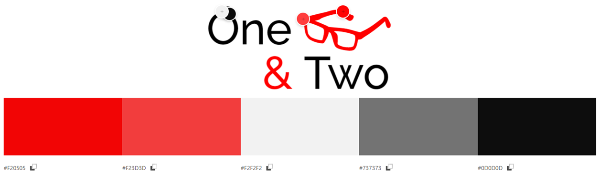


🛎️ **핵심 기능**

- **One** : 전문가의 **한줄평**을 한 눈에 보고 끌리는 영화을 찾을 수 있는 기능
- **Two** : 영화 **평점 수를 비교해서 맞추는 게임** 기능
- 사용자의 사용 기록에 따라 설계된 알고리즘을 기반으로 한 영화 추천 기능
- 기존 영화에 작성된 전문가의 한줄평 제공 기능.
- 자신만의 한줄평 작성 기능
- 영화 제목과 전문가 평론. 두 가지 방식의 영화 검색 기능
- 유저 간 소통이 가능한 커뮤니티 기능


:man: **팀원 역할**

- 고영일
  - Front-end 담당.
  - 아이디어 기획 및 테마 설정
  - 추천 알고리즘 기획, 기능 구현
  - Two 기획 및 기능 구현
  - ERD 제작 _ draw.io 활용
  - 목업 제작 _ Kakao Oven 활용
  - 목업에 따라 CSS 구현
- 이승민
  - Back-end 담당
  - 데이터 크롤링 및 DB 저장
  - 데이터 가공 및 fixtures 제작
  - 게시판 생성
  - 디버깅


:dart: **목표 서비스 구현 및 실제 구현 정도**

1. 목표
   - 영화 데이터 기반 추천 서비스 구성
   - 영화 추천 알고리즘 구성
   - 커뮤니티 서비스 구성
   - Git을 통한 소스코드 버전 관리 및 협업


2. 실제 구현 정도
   - `1. 목표` 사항, 기본 서비스 모두 구현 완료
     - TMDB의 API를 사용해 DB 생성
   - One & Two 기획 후 구현
     - 네이버 영화의 한줄평 크롤링 후 DB에 저장. 한줄평 중심 서비스 One 구현
     - 영화 평점 수 비교 게임 Two 구현


:cd: 데이터베이스 모델링 (ERD)

- [pjt.drawio - diagrams.net](https://app.diagrams.net/) 활용

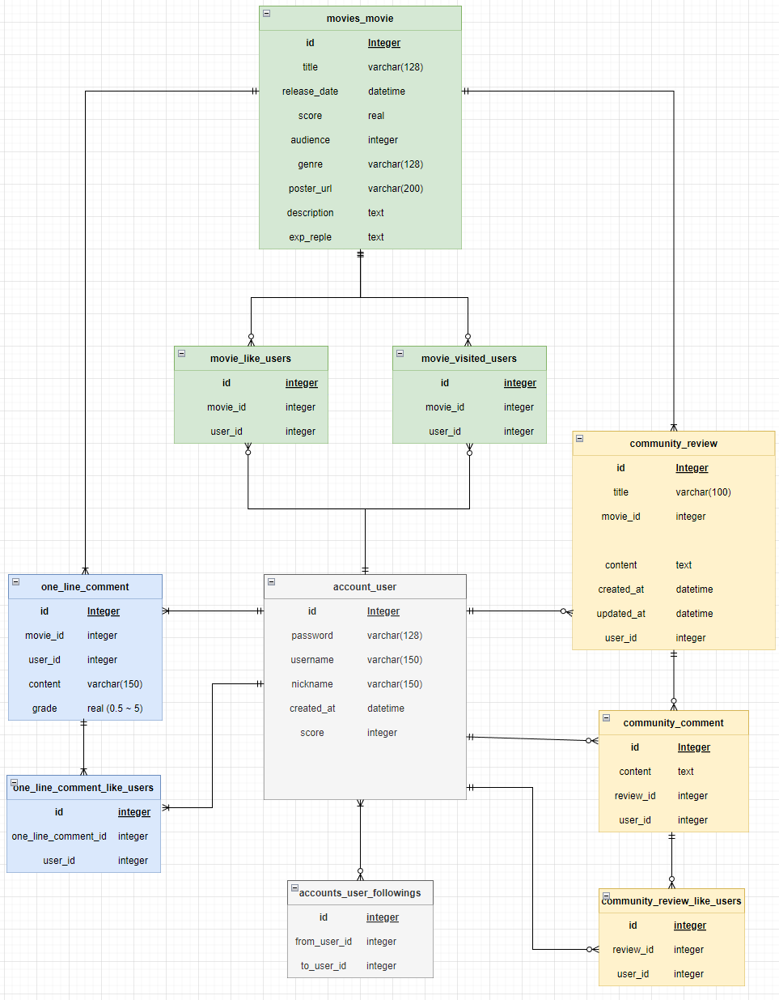


:dvd: 컴포넌트 구성

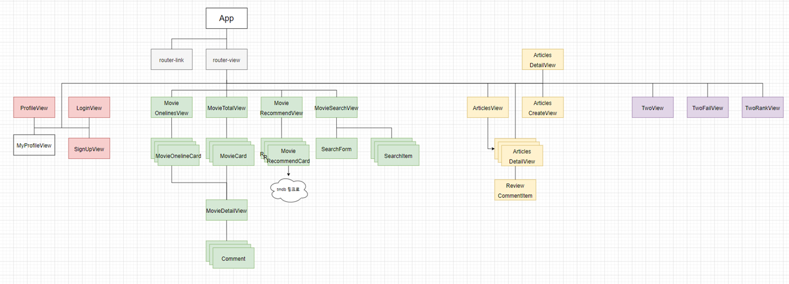


🤖영화 추천 알고리즘

- 각 유저마다 최근 방문한 영화 / 좋아요 누른 영화 / 작성한 한줄평의 평점을 저장하여 사용한다.
- `최근 방문한 영화 < 좋아요 누른 영화 < 작성한 한줄평의 평점이 높음` 순으로 가중치를 매긴다.
  - 단순히 찾아본 영화 보다는 좋아요 누른 영화의 더 가중치가 높게, 단순 좋아요 누른 영화보다 5점을 준 영화의 가중치가 높게 설정한다.
  - 3점을 기준으로 그보다 미만인 점수는 가중치가 마이너스, 그 초과인 점수는 가중치가 플러스 되도록 설정했다.
- 각 영화마다 계산된 점수에 따라서 비슷한 영화를 찾아서 10개의 영화를 추천한다.


---


### :mag: **상세 설명**

- One : 전문가의 한줄평을 한 눈에 보고 끌리는 영화을 찾을 수 있는 기능
  - 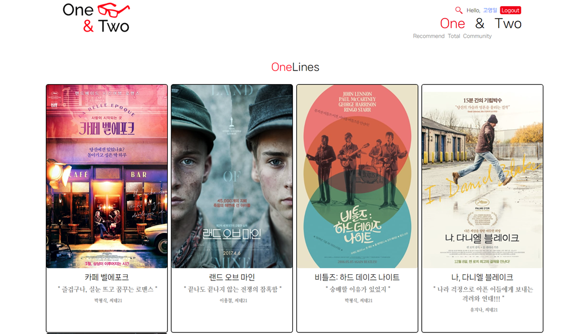


- Two : 영화 평점 수를 비교해서 맞추는 게임 기능

  - 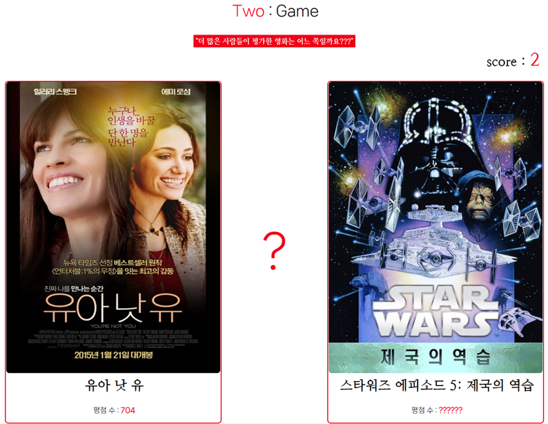
  - 계속해서 2개의 영화가 제시된다. 이를 보고 각각의 영화에 매겨진 평점 수(TMDB 기준)를 비교해서 더 많은 평점을 받은 영화를 틀리지 않고 연달아 고르며 기록에 도전하는 게임을 할 수 있다.

  - 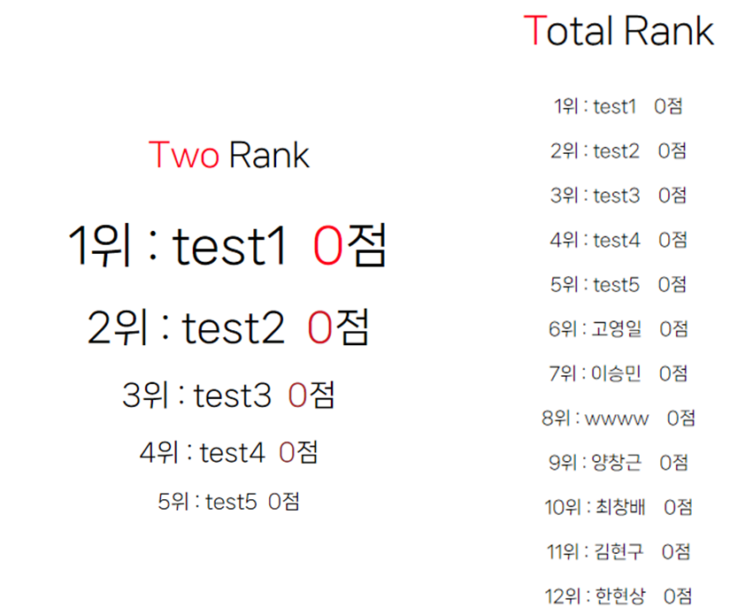
  - 랭킹에 도전할 수 있다.


- 사용자의 사용 기록에 따라 설계된 알고리즘을 기반으로 한 영화 추천 기능
  - 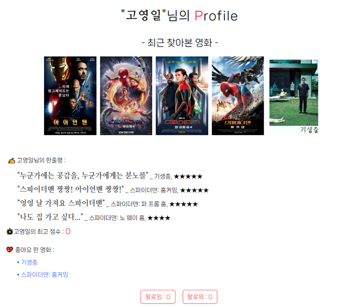
  - 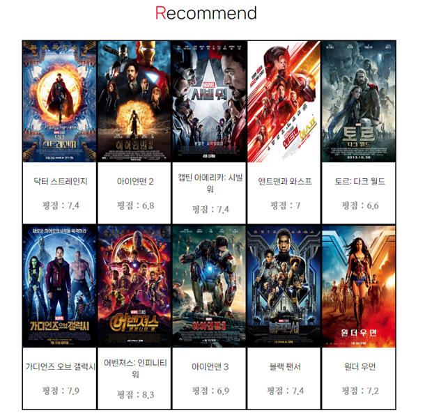


- 저장된 영화의 정보를 간단하게 볼 수 있다.
  - 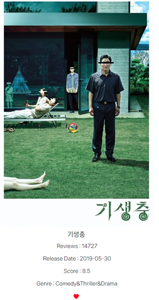


- 기존 영화에 작성된 전문가의 한줄평을 볼 수 있다.
  - 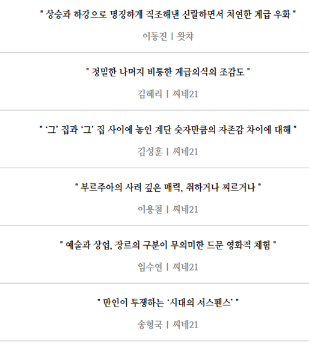


- 각 영화의 디테일 페이지에서 자신만의 한줄평을 작성 가능.
  - 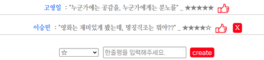


- 영화 제목, 저장된 전문가 평론을 통해 영화 검색 가능

  - 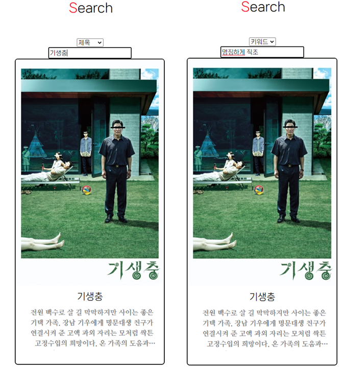

- 유저 간 소통이 가능한 커뮤니티 기능

  - 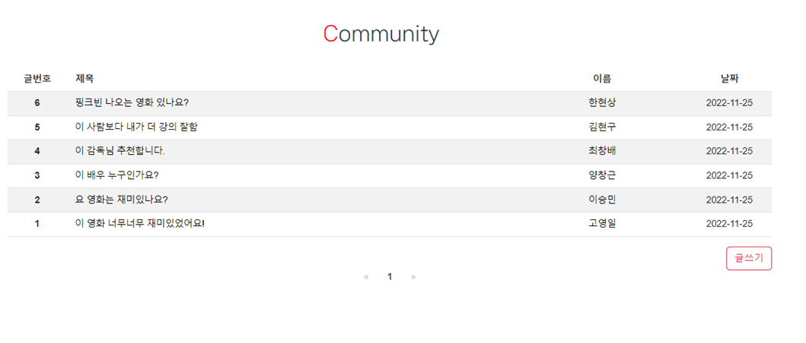

  - 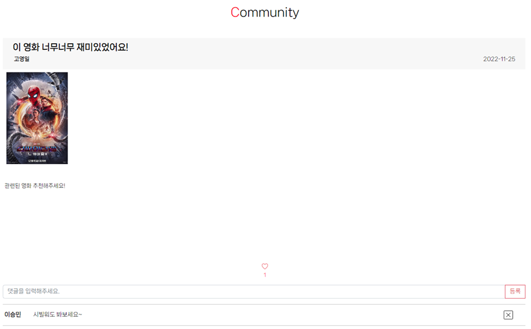


---


### \* 기타

📕 **How to start** _ 서버 구동 방법

```bash
# /final-pjt-back
$ python -m venv venv								# 가상환경 생성
$ source venv/Scripts/activate						# 가상환경 실행
$ pip install -r requirements.txt 					# requirements 설치
# $ python manage.py makemigrations					# 필요 시에 makemigrations
$ python manage.py migrate							# db 생성
$ python manage.py loaddata user.json data.json 	# 초기 데이터 불러오기
$ python manage.py runserver						# 서버 실행

# /final-pjt-front
$ npm install										# 모듈 설치
$ npm run serve										# 실행
```


:gear: **개발 환경**

- Django 3.2.13
  - Django REST Framework 3.14.0
- Python 3.9.13
- Vue 2.7.14
  - bootstrap-vue 2.23.1
  - vuex 3.6.2
  - vue-paginate 3.6.0
- node.js 16.18.0


:two_men_holding_hands: 느낀 점

- 배운 것을 기반으로 최대한 간단한 것부터 차츰 살을 붙여나가자고 계획했는데, 쉬운 아이디어라도 하나를 덧붙일 때마다 할 일이 굉장히 많이 늘어나는 느낌이었다.
- 크롤링을 해오는 것이나 추천 알고리즘을 설계하는 것, sqlite3과 csv 파일 사이를 오가는 과정 등 어려운 점이 많았다.
- 그래도 열심히 기획을 고민하고 노력한 결과 나름대로 결과물이 마음에 든다. 제작 중에도 많은 것을 배울 수 있었다.
- 다음에는 다양한 Module과 Library를 사용해보며 다채로운 기능을 구현해보고 싶다.
